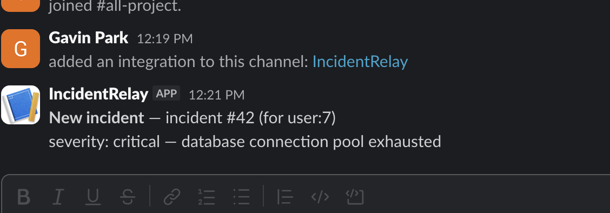

# IncidentRelay

**Live:** https://app-production-2270.up.railway.app ([health check](https://app-production-2270.up.railway.app/health), [notification history](https://app-production-2270.up.railway.app/notifications))

An async notification, rate-limiting, and caching service for [IncidentDesk](https://github.com/gpark1230/incident-desk) — the piece IncidentDesk is missing: nobody currently gets notified when an incident is created, updated, or commented on.

Rather than bolting a slow, synchronous notification call directly into IncidentDesk's request/response cycle, IncidentRelay is a separate, independently deployable service. IncidentDesk publishes a small JSON event to a shared Redis list whenever something happens; IncidentRelay picks it up, sends a Slack notification, tracks whether it succeeded, and retries with backoff if it didn't.



## Why this exists

"Design a rate limiter" and "how do you handle cache invalidation" are two of the most common system-design interview questions. This project is both of those, actually built, plus background job processing — three "beyond CRUD" pieces in one cohesive service instead of three disconnected toy demos.

## Architecture

```
IncidentDesk (separate repo/deploy/DB)
      │  RPUSH JSON event
      ▼
  Redis list: "incident_events"
      │  BLPOP
      ▼
 IncidentRelay listener  ──creates──▶  Postgres: notification_attempts (pending)
      │  enqueues RQ job
      ▼
   RQ worker  ──POST──▶  Slack incoming webhook
      │
      └─ on failure: RQ Retry (backoff) reschedules the same job,
         updating the same notification_attempts row
```

IncidentRelay never imports IncidentDesk's code and never touches IncidentDesk's database. The only coupling is the Redis list's name and JSON shape.

**Integration contract:** a Redis list named `incident_events`, JSON entries shaped like:
```json
{"event": "incident.created", "incident_id": 5, "user_id": 3, "details": "severity: critical", "timestamp": "2026-08-12T20:00:16Z"}
```

**Rate limiting:** before a notification is sent, the listener checks a Redis-backed token bucket per recipient (`RATE_LIMIT_MAX_TOKENS` per `RATE_LIMIT_WINDOW_SECONDS`, both configurable). The bucket is a single atomic Redis Lua script (`app/rate_limiter.py`) — read-compute-write in one round trip, so concurrent listener instances can't race each other into over-allowing. Over-limit events still get a `NotificationAttempt` row (`status=rate_limited`) so it's visible in `/notifications`, but no Slack send is attempted.

**Caching:** `GET /incidents/{id}` is a read-through proxy against IncidentDesk's real API, cached in Redis with a short TTL (`CACHE_TTL_SECONDS`). The listener invalidates the cache entry whenever it processes an `incident.updated` event for that same incident — unconditionally, independent of whether the notification for that event was rate-limited.

## Tech stack

- **FastAPI** — health check, notification history, and cached incident read-through endpoints (this is a real deployable service, not a bare worker script)
- **RQ (Redis Queue)** — background job processing with built-in retry/backoff, chosen over Celery for much less setup at this project's scale
- **Redis** — three jobs, one tool: the event bridge (`BLPOP`/`RPUSH`), the RQ job queue, the rate-limit token bucket, and the read-through cache
- **PostgreSQL + SQLAlchemy + Alembic** — its own database, tracking notification attempts
- **Slack incoming webhook** — the actual notification
- **pytest**, with the webhook call mocked and Postgres/Redis swapped for SQLite/fakeredis, so the whole suite runs without any live services
- **Docker Compose** — Postgres, Redis, the FastAPI app, the RQ worker, and the listener, as five services
- **GitHub Actions** — CI running the test suite on every push/PR

## Status

**Built so far:** event ingestion (listener), RQ-based job processing with retry/backoff, Postgres-backed notification history, token-bucket rate limiting, cached read-through incident proxy with invalidation and real IncidentDesk authentication (dedicated service account, JWT cached in Redis with proactive refresh), health check, Docker Compose stack, Alembic migrations, CI, and a full test suite — all verified end-to-end, not just unit tests: a real event pushed through the real pipeline (both locally and against the live Railway deployment), a burst of events proven to trip the rate limiter, a cache MISS→HIT→invalidation→MISS cycle proven against the real live IncidentDesk (not a stub), a measured 91.4% cache hit rate under simulated repeated-lookup traffic (`scripts/load_test_cache.py`), and a real Slack incoming webhook confirmed delivering an actual message to a live channel (`HTTP 200` from Slack, `notification_attempts.status = sent`) — both locally and in production.

Deployed to Railway: Postgres + Redis addons, three services (`app`, `worker`, `listener`) building from the same Dockerfile, migration run automatically via a pre-deploy command.

**Known limitation:** there's no Slack-user directory, so notifications currently address recipients as `user:{id}` in the message text rather than routing to a real per-user Slack DM (that would need Slack app OAuth scopes beyond a simple incoming webhook, which is out of scope for this project).

See [DECISIONS.md](./DECISIONS.md) for the reasoning behind these choices, including bugs hit along the way.

## Setup

```bash
cp .env.example .env   # fill in a real Slack webhook URL
docker compose up -d --build
docker compose exec app alembic upgrade head   # or run alembic locally against localhost:5433
curl http://localhost:8000/health
```

To simulate an IncidentDesk event without running IncidentDesk itself:

```bash
docker compose exec redis redis-cli RPUSH incident_events \
  '{"event": "incident.created", "incident_id": 5, "user_id": 3, "details": "severity: critical", "timestamp": "2026-08-13T18:00:00Z"}'
docker compose logs -f listener worker
curl http://localhost:8000/notifications
```

Run tests (no Docker required — Postgres/Redis are swapped for SQLite/fakeredis):

```bash
pip install -r requirements.txt
pytest -v
```
